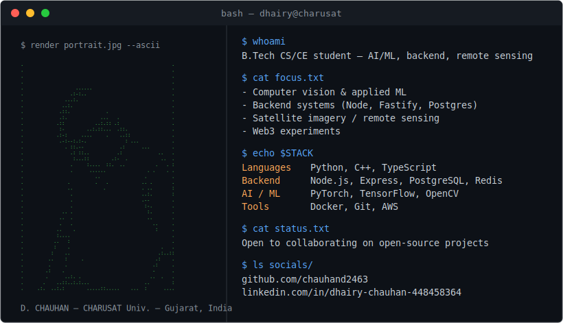
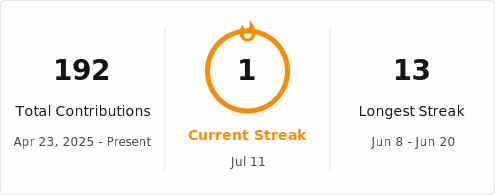

  

  

---

### Let's Connect

---

### Tech Stack

---

### GitHub Stats

> Cards above are generated daily by a GitHub Action and committed into `profile/` — no live third-party endpoint, no rate-limit breakage.
